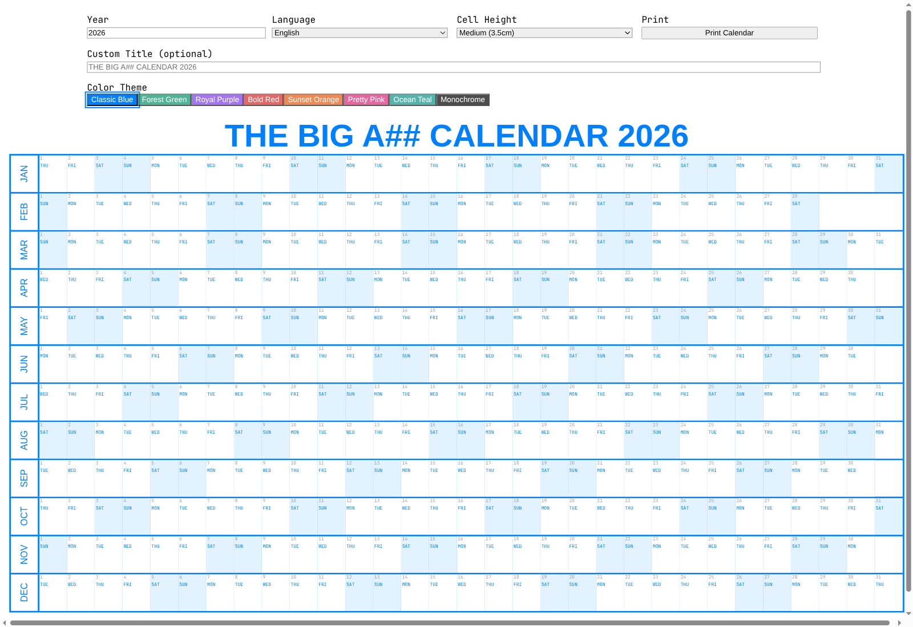
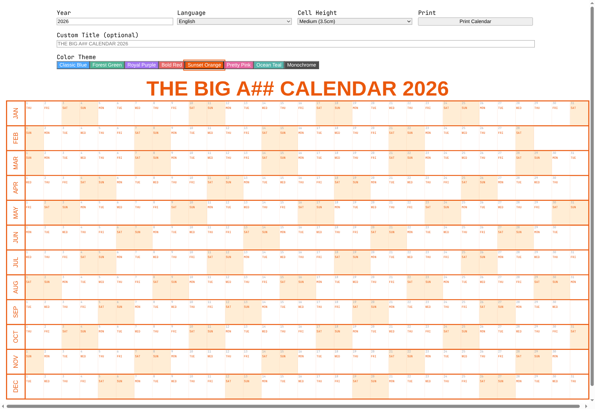

# Big Ass Calendar

A whole year on one sheet of paper.

Big Ass Calendar is a Next.js app that generates a customizable, print-optimized
year planner — 12 months as 12 rows, every day as a column — designed to be
printed at A1 and stuck on a wall where you can actually see it.

**Live demo → [iloire.github.io/bigasscalendar](https://iloire.github.io/bigasscalendar/)**



## Why

Month-grid calendars hide the year from you. A single continuous strip per month
makes streaks, gaps, trips, deadlines and habits obvious at a glance — which is
what you want when the thing is hanging on a wall and you're planning goals
rather than checking today's date.

## Features

- **Full year, one page** — all 12 months in a single continuous grid
- **Weekend highlighting** — Saturdays and Sundays are visually distinguished
- **8 color themes** — Classic Blue, Forest Green, Royal Purple, Bold Red,
  Sunset Orange, Pretty Pink, Ocean Teal, Monochrome
- **Bilingual** — English and Spanish day/month names
- **Adjustable cell height** — Compact (2.5 cm), Medium (3.5 cm),
  Large (4.5 cm), Extra Large (5.5 cm) to match your paper size
- **Custom title** — defaults to `THE BIG A## CALENDAR <year>`, override with
  anything you like
- **Any year** — 1900 to 2100, leap years included
- **Settings persist** — year, title, language, theme and cell height are saved
  to `localStorage`, so your setup is still there next time
- **Print optimized** — A1 landscape, proper page breaks, backgrounds preserved

<details>
<summary>Another theme (Sunset Orange)</summary>



</details>

## Tech stack

- Next.js 16 (App Router) · React 19 · TypeScript
- Tailwind CSS 4
- No database, no API routes, no accounts — everything runs client-side

## Getting started

Requires Node.js 18+.

```bash
npm install
npm run dev
```

Open <http://localhost:3000>.

```bash
npm run build && npm start   # production build
npm run lint                 # eslint
```

### Environment variables

Copy `.env.example` to `.env.local`. The only variable is optional:

| Variable | Purpose |
| --- | --- |
| `NEXT_PUBLIC_GA_MEASUREMENT_ID` | Google Analytics 4 measurement ID. Analytics only load when it is set **and** `NODE_ENV=production`, so local development never reports. |

## Usage

1. **Year** — pick any year from 1900 to 2100
2. **Language** — English or Spanish day/month names
3. **Cell height** — taller cells if you plan to write in them by hand
4. **Theme** — pick one of the 8 color schemes
5. **Custom title** — optional; leave blank for the default
6. **Print** — hit *Print Calendar* for a print-ready render

## Printing tips

- Designed for **A1 landscape**. A0 works too (bigger cells); A3 is readable but
  tight for handwriting — drop to Compact cell height.
- Set print margins to **None**.
- Enable **Background Graphics** in print settings, or the weekend shading and
  theme colors disappear.
- Use *Print to PDF* first if you're sending the file to a print shop.

## Deployment

The app is fully client-side — no API routes, no server actions — so it builds
to plain static HTML and can be hosted anywhere.

### GitHub Pages (current)

[`.github/workflows/deploy-pages.yml`](.github/workflows/deploy-pages.yml)
builds a static export on every push to `main` and publishes it to
<https://iloire.github.io/bigasscalendar/>. Nothing to run by hand.

To serve it from a custom domain (e.g. `bigasscalendar.com`) instead, blank out
`NEXT_PUBLIC_BASE_PATH` in the workflow and add a `public/CNAME` file — the base
path only exists because project pages live under a `/<repo>/` subpath.

Set a `NEXT_PUBLIC_GA_MEASUREMENT_ID` repository **variable** to enable
analytics on the Pages build; leave it unset and no analytics ship.

### Anywhere else

```bash
STATIC_EXPORT=true npm run build   # emits ./out — drop it on any static host
```

`next.config.ts` reads two env vars, so the plain `npm run build` used by
Vercel / `npm start` is unaffected:

| Variable | Effect |
| --- | --- |
| `STATIC_EXPORT=true` | turn on `output: "export"` and emit `./out` |
| `NEXT_PUBLIC_BASE_PATH` | serve from a subpath, e.g. `/bigasscalendar` |

## Project structure

```
app/
├── globals.css        # global styles + print CSS
├── layout.tsx         # root layout, SEO metadata, favicons
├── page.tsx           # controls + state (localStorage persistence)
└── sitemap.ts         # generated sitemap
components/
├── Calendar.tsx       # the year grid
├── Analytics.tsx      # GA4, production-only
└── StructuredData.tsx # JSON-LD for search engines
lib/
├── calendar.ts        # year/month/day generation, i18n day names
└── themes.ts          # the 8 color themes
docs/                  # README screenshots
```

## License

ISC
